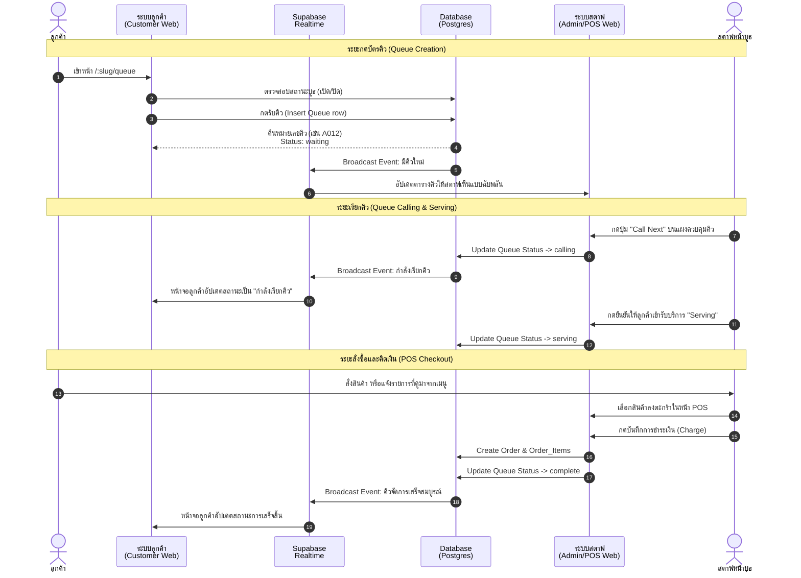
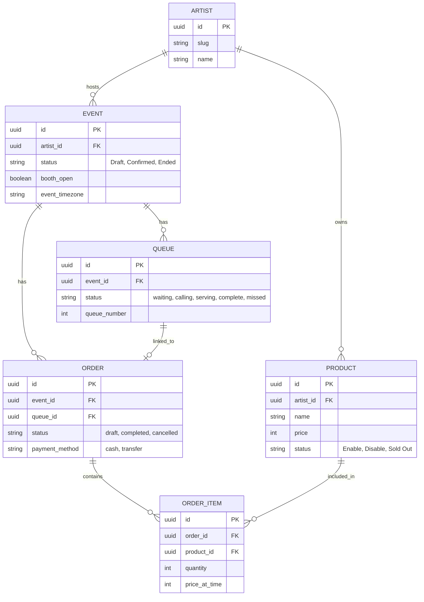

# แผนภาพสถาปัตยกรรมระบบ (Architecture) และโฟลว์การทำงาน (User Flow)
**โปรเจกต์:** EventQueueSocial (SaaS V1)

---

## 1. System Architecture Diagram
แผนภาพนี้แสดงโครงสร้างโดยรวมของระบบ ว่าส่วนใดเชื่อมต่อกันอย่างไร

```mermaid
flowchart TB
    %% Definitions
    subgraph Frontend [Frontend Application (React + Vite)]
        WebAdmin["Admin/Staff Web App\n(POS, Event Manage)"]
        WebCust["Customer Web App\n(Queue, Menu)"]
    end

    subgraph Backend [Backend Platform (Supabase)]
        direction TB
        Auth["Supabase Auth"]
        DB[(Supabase Postgres)]
        RT["Supabase Realtime\n(Postgres Changes)"]
        Storage["Supabase Storage\n(Menu Images, Avatars)"]
    end

    %% Connections
    WebAdmin -->|Authenticate| Auth
    WebAdmin -->|Read/Write Data| DB
    WebAdmin -->|Subscribe to updates| RT
    WebAdmin -->|Upload/Read Images| Storage

    WebCust -->|Read Data (Public)| DB
    WebCust -->|Subscribe to queue| RT
    WebCust -->|Read Images| Storage

    DB -.->|Trigger Realtime Events| RT

    %% Styling
    classDef primary fill:#4f46e5,stroke:#fff,stroke-width:2px,color:#fff;
    classDef secondary fill:#0ea5e9,stroke:#fff,stroke-width:2px,color:#fff;
    classDef db fill:#10b981,stroke:#fff,stroke-width:2px,color:#fff;

    class WebAdmin,WebCust primary;
    class Auth,RT,Storage secondary;
    class DB db;
```

---

## 2. Queue & POS Flow (Data Flow)
แผนภาพนี้แสดงลำดับขั้นตอน (Sequence) เมื่อลูกค้าเข้ามารับคิว และสตาฟทำการเรียกคิว/คิดเงินผ่านระบบ POS



---

## 3. Pre-Order Flow (กระแสลูกค้าสั่งซื้อผ่านมือถือ)
อธิบายขั้นตอนตั้งแต่ลูกค้าดูเมนู จนระบบบันทึกคำสั่งซื้อล่วงหน้า

```mermaid
flowchart TD
    A([เริ่ม: ลูกค้าเข้าหน้าเมนู /:slug/menu]) --> B{บูธเปิดรับออเดอร์หรือไม่?}
    B -- ไม่เปิด --> C[แสดงข้อความแจ้งเตือน บูธปิด]
    B -- เปิด --> D[เลือกสินค้าใส่ตะกร้า]
    D --> E{สินค้าในสต็อกพอไหม?}
    E -- ไม่พอ --> F[แจ้งเตือนสินค้าหมด]
    E -- พอ --> G[ลูกค้ายืนยันออเดอร์ (Submit)]
    
    G --> H[ระบบบันทึกออเดอร์ลง DB (Draft)]
    H --> I[อัปเดตแสดงที่หน้า POS ของสตาฟ (ผ่าน Realtime)]
    
    I --> J{สตาฟตรวจสอบออเดอร์}
    J -- ชำระเงินสำเร็จ --> K[บันทึก Order -> Completed]
    J -- ยกเลิกออเดอร์ --> L[บันทึก Order -> Cancelled & คืนสต็อก]
    
    K --> M([จบกระบวนการ])
    L --> M
```

---

## 4. Entity Relationship (Data Model)
ความสัมพันธ์ของข้อมูลหลักในระบบ (Core Entities)

