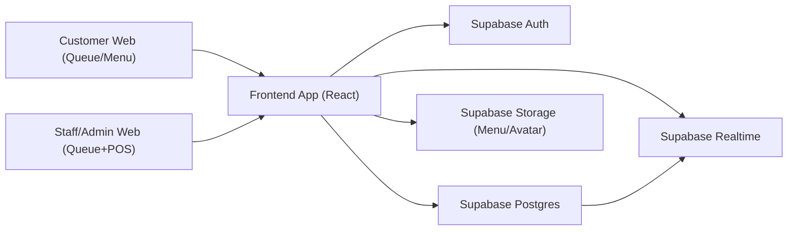

# Architecture Specification - SaaS V1

Document version: `1.0`  
Date: `2026-02-13`  
Scope: `Current architecture + target architecture for next phases`

## 1) Current Runtime Architecture

### Frontend
- Single-page web app (`Vite + React + TypeScript`)
- Public customer surfaces:
  - `/:slug/home`
  - `/:slug/menu`
  - `/:slug/queue`
- Admin surfaces:
  - `/manage-login`
  - `/manage-events`
  - `/manage-products`
  - `/manage-pos-queues`
  - `/manage-events/:eventId/history`

### Backend Platform
- Supabase Auth
- Supabase Postgres
- Supabase Realtime (`postgres_changes` channels)
- Supabase Storage buckets (`Menu`, `Avatar`)

### Data Entities
- `artists`
- `events`
- `products`
- `queues`
- `orders`
- `order_items`

## 2) Context Diagram (Logical)

## 3) Key Runtime Flows

### Queue Flow
1. Customer loads `/:slug/queue`
2. App resolves active event and booth status
3. Customer inserts queue row (`status=waiting`)
4. Admin calls next (`calling`) then confirms (`serving`)
5. Checkout marks queue `complete`

### Pre-Order + POS Flow
1. Customer creates `orders` + `order_items` from menu
2. POS subscribes to order changes by queue
3. Staff completes payment in POS
4. System updates order `completed` and queue `complete`

## 4) Security Architecture

### Current Controls
- Auth gate for admin routes in frontend
- RLS hardened migration added:
  - `/Users/kongzas/Desktop/Kong/EventQueueSocial/KongzasEvent/supabase/migrations/20260204170000_harden_rls_and_storage.sql`
- Storage policies tightened for `Menu` and `Avatar`

### Remaining Security Work
- Introduce staff role model (`owner`, `queue_only`, `queue_pos`)
- Enforce role checks at DB and UI level
- Improve ticket ownership semantics for anonymous queue users

## 5) Target Architecture (Phase A/B/C)

## Phase A (Core SaaS)
- Keep Supabase as system of record (OLTP)
- Add membership model:
  - `artist_members`
  - `artist_invites`
- Add inventory model:
  - `stock_total`, `stock_reserved`, `stock_sold`, `is_unlimited`
- Add `event_timezone` and normalize all date logic to event zone

## Phase B (Payment Integrity)
- Add payment service layer (`Edge Function` or backend service)
- Provider webhook endpoint updates payment status
- Order lifecycle expanded:
  - `draft -> confirmed -> paid/completed`

## Phase C (Growth Layer)
- Add media/feed bounded context
- Add loyalty bounded context
- Keep transaction engine isolated from social workloads

## 6) Realtime and Performance Strategy

### Current
- Realtime channels per table/event/user
- Some channels still broad and refetch aggressively

### Target
- Filter channels by tenant and scope (`artist_id`, `event_id`, `queue_id`)
- Reduce payload fields per channel
- Add lightweight cache layer in client state
- Define SLO:
  - Queue state propagation target `< 2s`

## 7) Timezone Strategy (Required Change)

### Current Risk
- Mixed use of `toISOString()` and local date formatting can cause boundary issues across countries

### Target
- Add `events.event_timezone` using IANA name (example: `Asia/Bangkok`)
- Store timestamps in UTC
- Interpret and render according to event timezone for:
  - active-event resolution
  - booth open logic
  - queue day boundaries

## 8) Operational Architecture

### Environments
- Local
- Staging
- Production

### Deployment
- Frontend static deploy (`dist/`)
- Supabase migrations managed in repo

### Observability Gaps
- No centralized error/trace by default
- Recommend:
  - frontend error monitoring
  - DB audit logs for critical state transitions

## 9) Architecture Decisions

### Decision A
- Keep OLTP on Postgres/Supabase for queue/POS/order path

### Decision B
- Add analytics sink later (BigQuery optional) without moving transactional core

### Decision C
- Delay feed/live until core operations reach stable SLA
